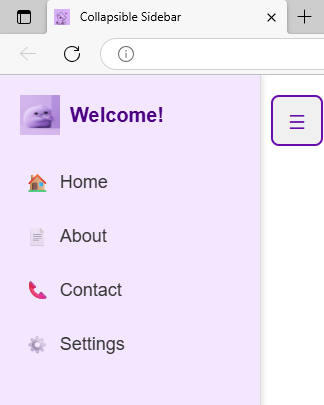

# 📋 Collapsible Sidebar

[](https://developer.mozilla.org/en-US/docs/Web/HTML) 
[](https://developer.mozilla.org/en-US/docs/Web/CSS) 
[](https://developer.mozilla.org/en-US/docs/Web/JavaScript) 
[](https://github.com/)

A responsive and interactive sidebar navigation component built with HTML, CSS, and JavaScript. Designed to enhance user experience and showcase front-end development skills for dashboards and web applications.

---

## 🚀 Features

1. 📐 **Responsive Design**  
   Works seamlessly on desktops, tablets, and mobile devices.

2. ⚡ **Smooth Toggle Animation**  
   Sidebar can expand and collapse with smooth CSS transitions.

3. 🖱️ **Interactive Navigation**  
   Clickable links with icons, organized for better UX.

4. 🎨 **Customizable Styles**  
   Easily adjust colors, fonts, sizes, and icons to match branding.

5. ♿ **Accessible**  
   Keyboard-friendly toggle and focusable navigation links.

---

## 🛠 Tech Stack

| Category             | Tools Used                                  |
|---------------------|--------------------------------------------|
| Languages            | HTML5, CSS3, JavaScript                     |
| Frameworks/Libraries | None (Vanilla JS & CSS)                     |
| IDE/Editor           | VS Code                                     |
| Version Control      | Git, GitHub                                 |
| Other Tools          | Browser DevTools for debugging and testing |

---

## 📁 Folder Structure


```text
collapsible-sidebar/
├── index.html        # Main HTML file
├── style.css         # CSS styling for sidebar
├── script.js         # JavaScript for toggle functionality
├── images/           # Icons, screenshots, or demo GIFs
└── README.md         # Project documentation
```

📸 Screenshots / Demo

  



## 🧪 Installation & Usage

### 🖥 Requirements
- Modern web browser (Chrome, Firefox, Edge, Safari)  
- Text editor or IDE (VS Code recommended)  
- Git (optional)


